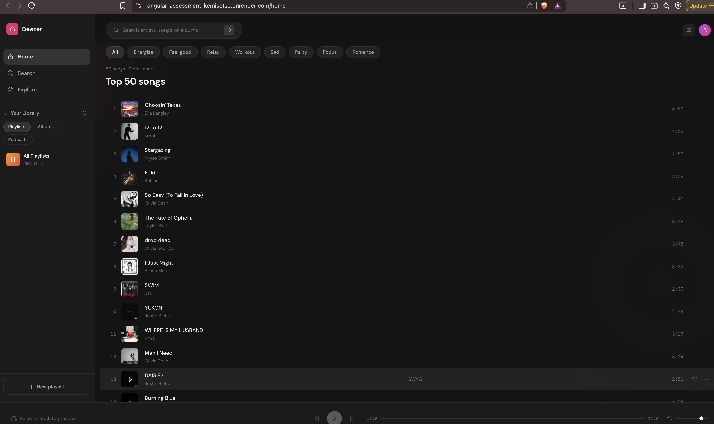
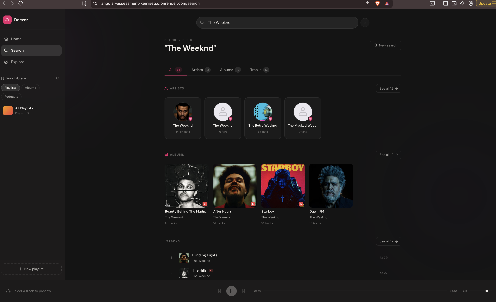
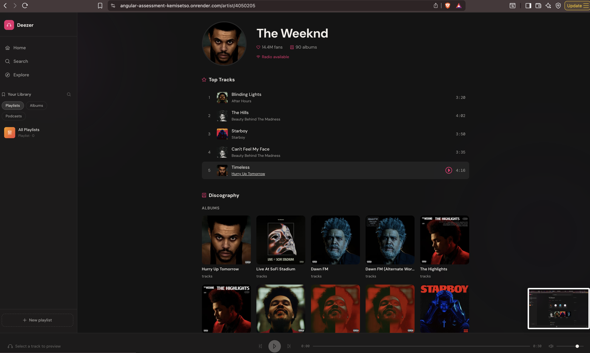
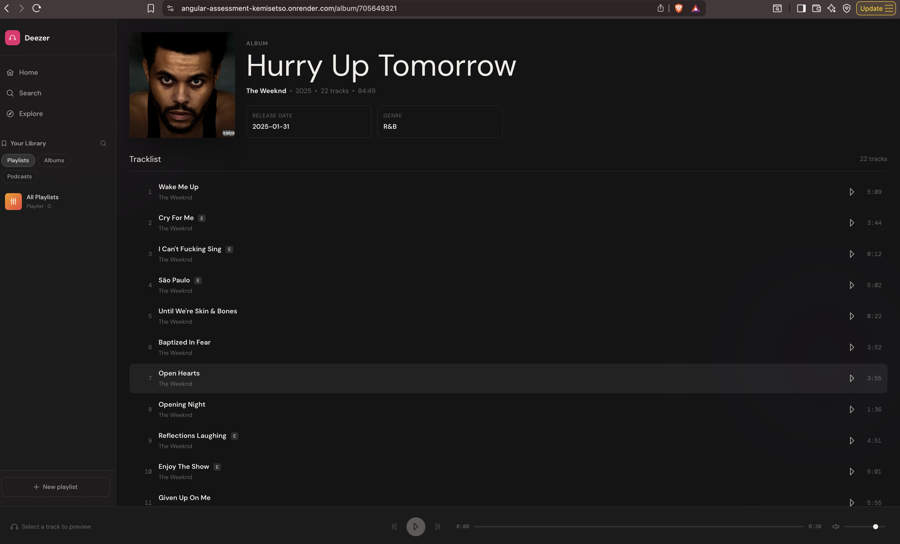
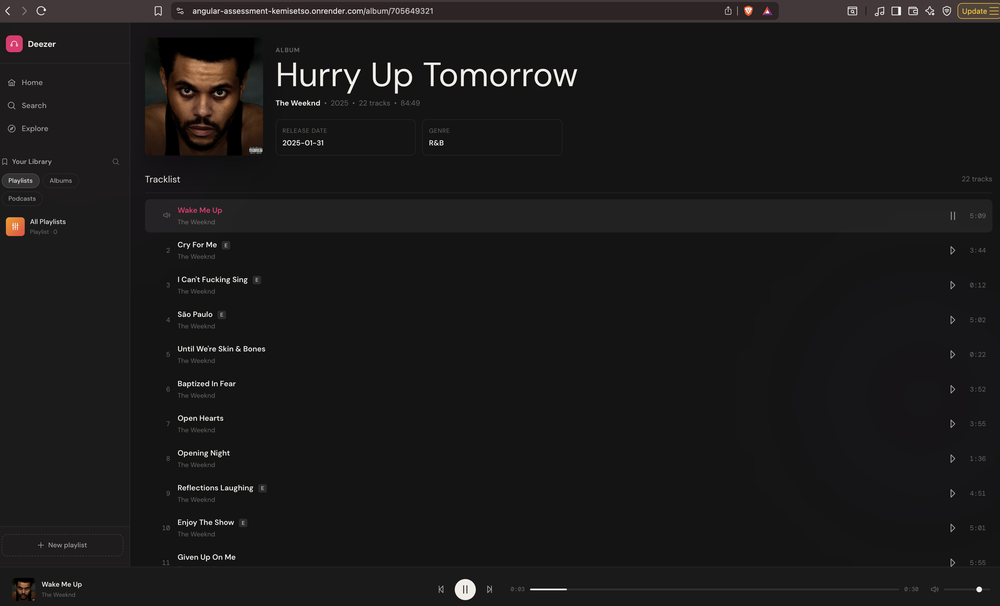
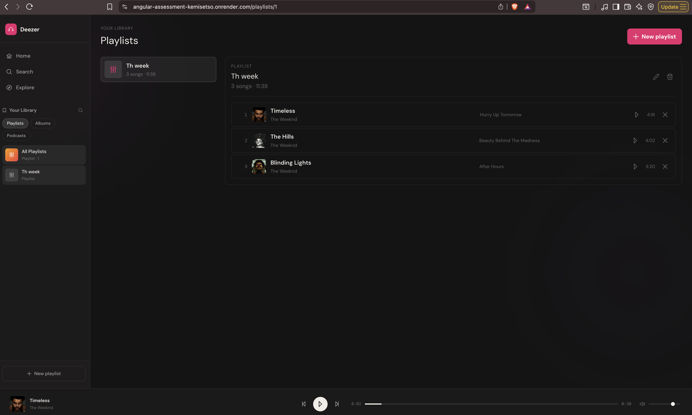

# Deezer Music App

An Angular 21 music discovery app built with the Deezer public API. Search the catalogue, browse artists and albums, preview tracks, and manage playlists that persist across sessions via IndexedDB.

> > Live: [https://angular-assessment-kemisetso.onrender.com](https://angular-assessment-kemisetso.onrender.com)

---

## Features

- Search artists, albums, and tracks from Deezer with debounced input
- Browse the global Top 50 chart on the home screen
- Artist detail pages — bio, top tracks, and full discography
- Album detail pages — release date, genre, and tracklist
- Track cards showing duration, track number, and an inline 30-second audio preview
- Playlist management (fully local, no account required):
  - Create, rename, and delete playlists
  - Add and remove individual tracks
  - View playlist count and total duration
  - Persisted in IndexedDB via Dexie and rehydrated on load
- Lazy-loaded feature routes with Angular Router
- Fully responsive layout from mobile through desktop

---

## Tech Stack

| Tool                | Purpose                                                   |
| ------------------- | --------------------------------------------------------- |
| Angular 21          | Framework — standalone components, signals-first          |
| TypeScript (strict) | Type safety throughout                                    |
| Angular Signals     | Primary state management                                  |
| RxJS                | Debounce, switchMap, forkJoin where signals fall short    |
| PrimeNG             | UI component library                                      |
| SCSS                | Styling — BEM conventions                                 |
| Dexie               | IndexedDB wrapper for playlist persistence                |
| Deezer API          | Music data — no credentials required for public endpoints |
| Vercel              | Hosting and deployment                                    |

---

## Project Structure

```text
src/app
├── core
│   ├── models          # TypeScript interfaces for all Deezer API shapes
│   ├── services        # HTTP services — all API calls live here
│   └── stores          # Injectable signal stores
├── features
│   ├── album           # /album/:id
│   ├── artist          # /artist/:id
│   ├── home            # / — top chart
│   ├── playlist        # /playlists
│   └── search          # /search
├── shared
│   ├── components      # Reusable UI components (track card, player bar, etc.)
│   ├── layout          # Shell, nav, sidebar
│   └── pipes           # Custom pipes (format duration, etc.)
└── db.ts               # Dexie database definition
```

The app uses a feature-based folder structure. Each major screen owns its own view logic and styles. Shared services, stores, models, and pipes live under `core` and `shared` to keep things reusable and easy to navigate.

---

## State Management — Signals

This project uses Angular Signals instead of NgRx.

**Why Signals?** Most state in this app is either local UI state or small pieces of shared app state: search results, the current player, playlist lists, loading flags, and errors. Injectable signal stores cover all of these cases cleanly without the boilerplate of NgRx actions, reducers, and effects. Signals also integrate well with Angular's change detection, so components only re-render when the signals they read actually change.

**Where RxJS is still used — and why:**

| Usage                       | Reason                                                                                        |
| --------------------------- | --------------------------------------------------------------------------------------------- |
| Debounced search input      | `debounceTime` + `distinctUntilChanged` on a form control — signals have no built-in debounce |
| `switchMap` for search      | Cancels in-flight HTTP requests when a new search fires                                       |
| `forkJoin` for artist page  | Loads artist info and top tracks in parallel                                                  |
| Dexie `liveQuery()` interop | Dexie's reactive query is Observable-based; bridged to signals via `toSignal()`               |

RxJS is used only where it is the right tool. Signals are the default.

---

## Angular 21 Conventions

This project follows Angular 21's modern APIs throughout. The following legacy patterns are not used anywhere:

| Legacy (not used)        | Modern replacement                                   |
| ------------------------ | ---------------------------------------------------- |
| `@Input()` / `@Output()` | `input()` / `output()` signals                       |
| `*ngIf` / `*ngFor`       | `@if` / `@for` / `@defer` control flow               |
| Constructor injection    | `inject()` function                                  |
| NgModules                | Standalone components with explicit `imports` arrays |

---

## Deezer API & Proxy

The Deezer public API does not require an API key for read-only endpoints. All calls are made through the Angular dev-server proxy configured in `proxy.conf.json`:

```json
{
  "/api": {
    "target": "https://api.deezer.com",
    "secure": false,
    "changeOrigin": true,
    "pathRewrite": {
      "^/api": ""
    }
  }
}
```

This rewrites `/api/...` in the app to `https://api.deezer.com/...` at the proxy layer — no CORS issues in development. On Vercel, the same rewrites are declared in `vercel.json`.

---

## Getting Started

**Prerequisites:** Node.js 20+ and npm.

```bash
# Install dependencies
npm install

# Start the dev server (opens on http://localhost:4200)
npm run start
```

No API keys or environment files are required.

---

## Scripts

```bash
npm run start    # Start the Angular dev server with proxy
npm run build    # Production build
npm run lint     # Run ESLint
```

---

## Deployment

The app is deployed on **Vercel**. Vercel handles the SPA routing fallback and the Deezer API proxy rewrites via `vercel.json`.

> Live: [https://angular-assessment-kemisetso.onrender.com](https://angular-assessment-kemisetso.onrender.com)

---

## Screenshots

| Screen         | Preview                             |
| -------------- | ----------------------------------- |
| Home / Top 50  |             |
| Search         |         |
| Artist Details |         |
| Album Details  |           |
| Song Player    |  |
| Playlists      |    |

---

## Notes

- Playlist data is stored in the browser's IndexedDB. Clearing site data will erase saved playlists.
- No Deezer account or credentials are required. The app uses Deezer's public read-only API.
- Audio previews are 30-second clips served directly from Deezer's CDN.

---

## References & Documentation

### Angular

- [Angular Signals guide](https://angular.dev/guide/signals)
- [Angular dependency injection — `inject()`](https://angular.dev/guide/dependency-injection)
- [Angular control flow — `@if`, `@for`, `@defer`](https://angular.dev/guide/templates/control-flow)
- [Angular standalone components](https://angular.dev/guide/components/importing)
- [Angular lazy loading with `loadComponent`](https://angular.dev/guide/routing/lazy-loading)
- [Angular Reactive Forms](https://angular.dev/guide/forms/reactive-forms)
- [Angular CDK a11y](https://material.angular.io/cdk/a11y/overview)
- [`toSignal` and `rxResource`](https://angular.dev/guide/signals/rxjs-interop)

### PrimeNG

- [PrimeNG styled theming](https://primeng.org/theming/styled)
- [PrimeNG tabs](https://primeng.org/tabs)
- [PrimeNG — Angular 17+ standalone usage](https://primeng.org/installation)

### Deezer API

- [Deezer API reference](https://developers.deezer.com/api)
- [Deezer chart endpoint](https://stackoverflow.com/questions/29748780/getting-most-listened-to-tracks-by-country-using-deezer-api)

### Dexie / IndexedDB

- [Dexie TypeScript docs](https://dexie.org/docs/Typescript)
- [Dexie `liveQuery()`](<https://dexie.org/docs/liveQuery()>)

### RxJS

- [`debounceTime`](https://rxjs.dev/api/operators/debounceTime)
- [`switchMap`](https://rxjs.dev/api/operators/switchMap)
- [`forkJoin`](https://rxjs.dev/api/index/function/forkJoin)

### Web APIs

- [HTMLAudioElement API](https://developer.mozilla.org/en-US/docs/Web/API/HTMLAudioElement)

### Project conventions

- [Feature-based Angular project structure](https://medium.com/@dragos.atanasoae_62577/angular-project-structure-guide-small-medium-and-large-projects-e17c361b2029)
- [Meaningful Git commit messages](https://medium.com/@iambonitheuri/the-art-of-writing-meaningful-git-commit-messages-a56887a4cb49)
- [Music app UI inspiration — Dribbble](https://dribbble.com/search/music-app)

### Vercel

- [Vercel SPA routing — rewrites](https://vercel.com/docs/projects/project-configuration#rewrites)
